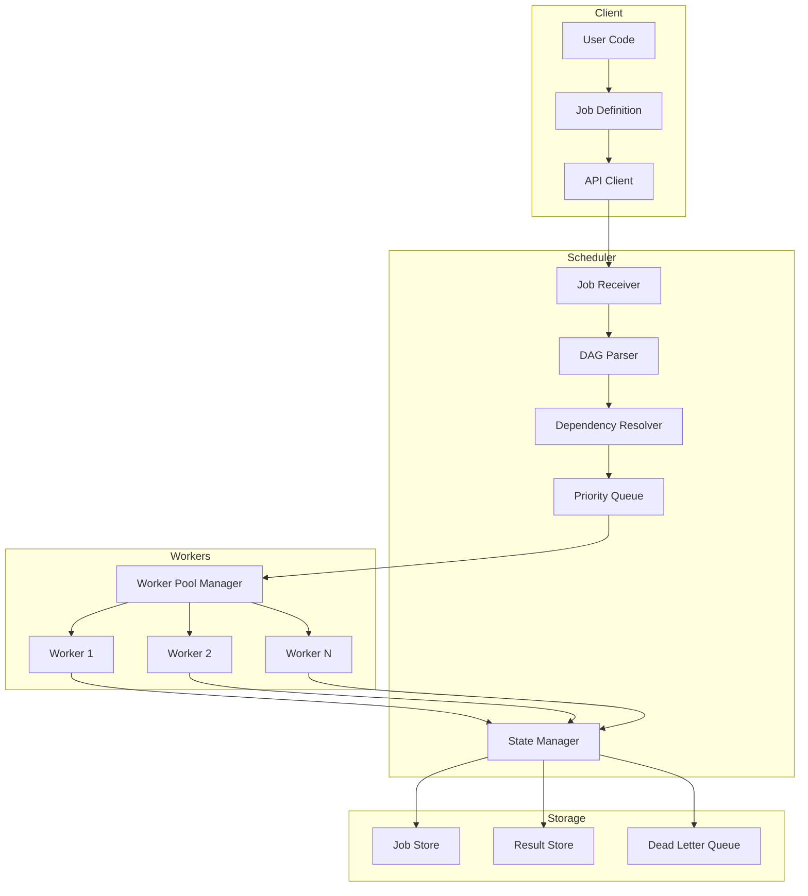
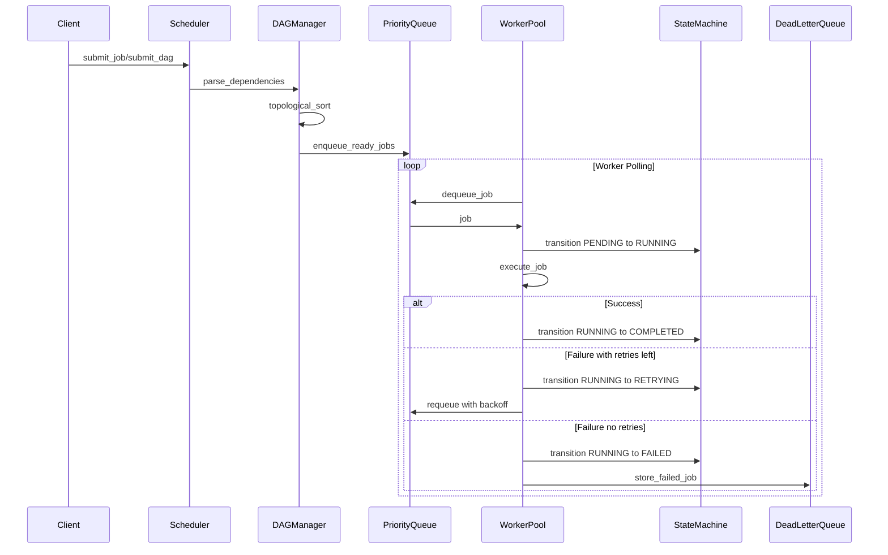
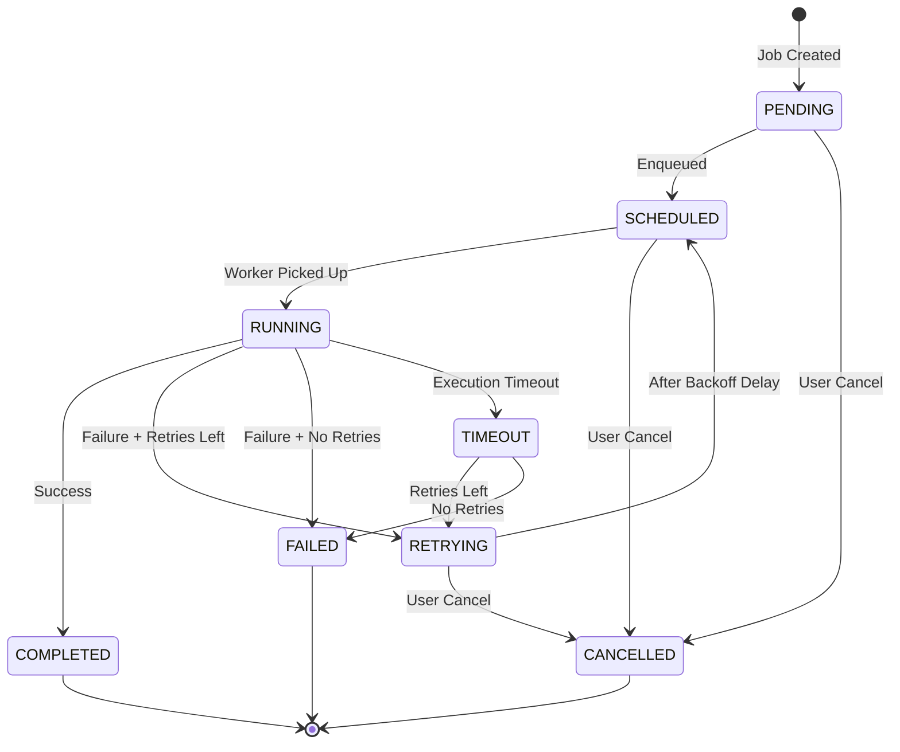

# Job Orchestrator Architecture Document

**Version:** 1.0.0  
**Author:** Architecture Team  
**Last Updated:** 2024  

---

## Table of Contents

1. [System Overview](#1-system-overview)
2. [Core Components](#2-core-components)
3. [Data Models](#3-data-models)
4. [Component Design](#4-component-design)
5. [API Design](#5-api-design)
6. [Configuration Schema](#6-configuration-schema)
7. [Project File Structure](#7-project-file-structure)
8. [Implementation Guidelines](#8-implementation-guidelines)

---

## 1. System Overview

### 1.1 Introduction

The Job Orchestrator is a lightweight, high-performance background job processing system designed as an alternative to Celery/Airflow. It provides DAG-based job scheduling, priority queuing, automatic retries, and dynamic worker scaling—all with minimal external dependencies.

### 1.2 Design Principles

- **Lightweight:** Core functionality uses only Python stdlib (threading, multiprocessing, queue)
- **Memory-Efficient:** Custom data structures optimized for thousands of concurrent jobs
- **Extensible:** Optional backends for Redis/PostgreSQL persistence
- **Observable:** Built-in metrics, logging, and state introspection
- **Fault-Tolerant:** Automatic retries, dead letter queues, transaction rollbacks

### 1.3 High-Level Architecture Diagram

```
┌─────────────────────────────────────────────────────────────────────────────────┐
│                              JOB ORCHESTRATOR SYSTEM                            │
├─────────────────────────────────────────────────────────────────────────────────┤
│                                                                                 │
│  ┌─────────────┐    ┌──────────────────────────────────────────────────────┐   │
│  │   Client    │    │                    SCHEDULER                          │   │
│  │    API      │───▶│  ┌─────────────┐  ┌─────────────┐  ┌─────────────┐   │   │
│  │             │    │  │ DAG Manager │  │  Priority   │  │   State     │   │   │
│  └─────────────┘    │  │             │  │   Queue     │  │  Machine    │   │   │
│                     │  │ - Parse DAG │  │             │  │             │   │   │
│                     │  │ - Resolve   │  │ - Heap-based│  │ - PENDING   │   │   │
│                     │  │   deps      │  │ - O(log n)  │  │ - RUNNING   │   │   │
│                     │  │ - Topo sort │  │   insert    │  │ - COMPLETED │   │   │
│                     │  └──────┬──────┘  └──────┬──────┘  │ - FAILED    │   │   │
│                     │         │                │         │ - RETRYING  │   │   │
│                     │         └────────┬───────┘         └──────┬──────┘   │   │
│                     └──────────────────┼────────────────────────┼──────────┘   │
│                                        │                        │              │
│                                        ▼                        ▼              │
│  ┌──────────────────────────────────────────────────────────────────────────┐  │
│  │                           WORKER POOL MANAGER                             │  │
│  │  ┌──────────┐  ┌──────────┐  ┌──────────┐  ┌──────────┐  ┌──────────┐   │  │
│  │  │ Worker 1 │  │ Worker 2 │  │ Worker 3 │  │ Worker N │  │ Scaler   │   │  │
│  │  │ Thread/  │  │ Thread/  │  │ Thread/  │  │ Thread/  │  │          │   │  │
│  │  │ Process  │  │ Process  │  │ Process  │  │ Process  │  │ Auto     │   │  │
│  │  └────┬─────┘  └────┬─────┘  └────┬─────┘  └────┬─────┘  │ Scale    │   │  │
│  │       │             │             │             │        └──────────┘   │  │
│  └───────┼─────────────┼─────────────┼─────────────┼────────────────────────┘  │
│          │             │             │             │                           │
│          ▼             ▼             ▼             ▼                           │
│  ┌──────────────────────────────────────────────────────────────────────────┐  │
│  │                         DISTRIBUTED LOCK MANAGER                          │  │
│  │  ┌─────────────────┐  ┌─────────────────┐  ┌─────────────────────────┐   │  │
│  │  │  In-Memory Lock │  │   Redis Lock    │  │   Database Lock         │   │  │
│  │  │  (single node)  │  │  (distributed)  │  │   (distributed)         │   │  │
│  │  └─────────────────┘  └─────────────────┘  └─────────────────────────┘   │  │
│  └──────────────────────────────────────────────────────────────────────────┘  │
│                                                                                 │
│  ┌──────────────────────────────────────────────────────────────────────────┐  │
│  │                           STORAGE BACKENDS                                │  │
│  │  ┌─────────────────┐  ┌─────────────────┐  ┌─────────────────────────┐   │  │
│  │  │ In-Memory Store │  │  Redis Backend  │  │  PostgreSQL Backend     │   │  │
│  │  │ (development)   │  │  (production)   │  │  (production)           │   │  │
│  │  └─────────────────┘  └─────────────────┘  └─────────────────────────┘   │  │
│  └──────────────────────────────────────────────────────────────────────────┘  │
│                                                                                 │
│  ┌──────────────────────────────────────────────────────────────────────────┐  │
│  │                          DEAD LETTER QUEUE                                │  │
│  │  ┌─────────────────────────────────────────────────────────────────────┐ │  │
│  │  │   Failed Jobs   │   Error Details   │   Retry History   │  Manual  │ │  │
│  │  │   Storage       │   + Stack Trace   │   + Timestamps    │  Replay  │ │  │
│  │  └─────────────────────────────────────────────────────────────────────┘ │  │
│  └──────────────────────────────────────────────────────────────────────────┘  │
│                                                                                 │
└─────────────────────────────────────────────────────────────────────────────────┘
```

### 1.4 Data Flow Diagram



---

## 2. Core Components

### 2.1 Component Overview

| Component | Responsibility | Thread Safety |
|-----------|---------------|---------------|
| **JobScheduler** | Main entry point, coordinates all components | Yes |
| **DAGManager** | Parses and resolves job dependencies | Yes |
| **PriorityQueue** | Memory-efficient job queuing | Yes |
| **WorkerPool** | Manages worker threads/processes | Yes |
| **StateMachine** | Tracks job lifecycle states | Yes |
| **LockManager** | Distributed locking | Yes |
| **DeadLetterQueue** | Failed job storage | Yes |
| **ResultStore** | Job result storage | Yes |

### 2.2 Component Interaction Sequence



---

## 3. Data Models

### 3.1 Core Entities

#### 3.1.1 Job

```python
from dataclasses import dataclass, field
from datetime import datetime
from enum import Enum
from typing import Any, Callable, Dict, List, Optional
from uuid import UUID, uuid4


class JobState(Enum):
    """Job lifecycle states."""
    PENDING = "pending"          # Waiting to be executed
    SCHEDULED = "scheduled"      # In queue, waiting for worker
    RUNNING = "running"          # Currently being executed
    COMPLETED = "completed"      # Successfully finished
    FAILED = "failed"            # Failed after all retries
    RETRYING = "retrying"        # Failed, waiting for retry
    CANCELLED = "cancelled"      # Manually cancelled
    TIMEOUT = "timeout"          # Exceeded execution timeout


class JobPriority(Enum):
    """Job priority levels."""
    CRITICAL = 0    # Highest priority
    HIGH = 1
    NORMAL = 2
    LOW = 3
    BACKGROUND = 4  # Lowest priority


@dataclass
class RetryPolicy:
    """Configuration for job retry behavior."""
    max_retries: int = 3
    base_delay: float = 1.0              # Base delay in seconds
    max_delay: float = 300.0             # Maximum delay in seconds
    exponential_base: float = 2.0        # Exponential backoff multiplier
    jitter: bool = True                  # Add randomness to prevent thundering herd
    retry_on: tuple = (Exception,)       # Exception types to retry on
    
    def calculate_delay(self, attempt: int) -> float:
        """Calculate delay for given attempt using exponential backoff."""
        import random
        delay = min(
            self.base_delay * (self.exponential_base ** attempt),
            self.max_delay
        )
        if self.jitter:
            delay *= (0.5 + random.random())  # 50-150% of calculated delay
        return delay


@dataclass
class Job:
    """Core job entity representing a unit of work."""
    
    # Identity
    id: UUID = field(default_factory=uuid4)
    name: str = ""
    description: str = ""
    
    # Execution
    func: Optional[Callable] = None           # Function to execute
    func_path: str = ""                        # Module path for serialization
    args: tuple = field(default_factory=tuple)
    kwargs: Dict[str, Any] = field(default_factory=dict)
    
    # Scheduling
    priority: JobPriority = JobPriority.NORMAL
    scheduled_at: Optional[datetime] = None   # When to execute
    timeout: Optional[float] = None           # Execution timeout in seconds
    
    # State
    state: JobState = JobState.PENDING
    attempt: int = 0
    
    # Dependencies
    depends_on: List[UUID] = field(default_factory=list)
    
    # Retry
    retry_policy: RetryPolicy = field(default_factory=RetryPolicy)
    
    # Metadata
    created_at: datetime = field(default_factory=datetime.utcnow)
    started_at: Optional[datetime] = None
    completed_at: Optional[datetime] = None
    
    # Results
    result: Any = None
    error: Optional[str] = None
    traceback: Optional[str] = None
    
    # Tags for filtering/grouping
    tags: Dict[str, str] = field(default_factory=dict)
    
    def __lt__(self, other: "Job") -> bool:
        """Comparison for priority queue ordering."""
        if self.priority.value != other.priority.value:
            return self.priority.value < other.priority.value
        return (self.scheduled_at or self.created_at) < (other.scheduled_at or other.created_at)
    
    def to_dict(self) -> Dict[str, Any]:
        """Serialize job to dictionary for storage."""
        return {
            "id": str(self.id),
            "name": self.name,
            "description": self.description,
            "func_path": self.func_path,
            "args": list(self.args),
            "kwargs": self.kwargs,
            "priority": self.priority.value,
            "scheduled_at": self.scheduled_at.isoformat() if self.scheduled_at else None,
            "timeout": self.timeout,
            "state": self.state.value,
            "attempt": self.attempt,
            "depends_on": [str(uid) for uid in self.depends_on],
            "retry_policy": {
                "max_retries": self.retry_policy.max_retries,
                "base_delay": self.retry_policy.base_delay,
                "max_delay": self.retry_policy.max_delay,
                "exponential_base": self.retry_policy.exponential_base,
                "jitter": self.retry_policy.jitter,
            },
            "created_at": self.created_at.isoformat(),
            "started_at": self.started_at.isoformat() if self.started_at else None,
            "completed_at": self.completed_at.isoformat() if self.completed_at else None,
            "result": self.result,
            "error": self.error,
            "traceback": self.traceback,
            "tags": self.tags,
        }
    
    @classmethod
    def from_dict(cls, data: Dict[str, Any]) -> "Job":
        """Deserialize job from dictionary."""
        from uuid import UUID
        job = cls(
            id=UUID(data["id"]),
            name=data["name"],
            description=data.get("description", ""),
            func_path=data["func_path"],
            args=tuple(data.get("args", [])),
            kwargs=data.get("kwargs", {}),
            priority=JobPriority(data["priority"]),
            timeout=data.get("timeout"),
            state=JobState(data["state"]),
            attempt=data.get("attempt", 0),
            depends_on=[UUID(uid) for uid in data.get("depends_on", [])],
            tags=data.get("tags", {}),
        )
        
        if data.get("scheduled_at"):
            job.scheduled_at = datetime.fromisoformat(data["scheduled_at"])
        if data.get("created_at"):
            job.created_at = datetime.fromisoformat(data["created_at"])
        if data.get("started_at"):
            job.started_at = datetime.fromisoformat(data["started_at"])
        if data.get("completed_at"):
            job.completed_at = datetime.fromisoformat(data["completed_at"])
            
        if retry_data := data.get("retry_policy"):
            job.retry_policy = RetryPolicy(**retry_data)
            
        job.result = data.get("result")
        job.error = data.get("error")
        job.traceback = data.get("traceback")
        
        return job
```

#### 3.1.2 DAG (Directed Acyclic Graph)

```python
@dataclass
class DAGNode:
    """A node in the DAG representing a job with its dependencies."""
    job: Job
    upstream: List["DAGNode"] = field(default_factory=list)   # Jobs this depends on
    downstream: List["DAGNode"] = field(default_factory=list) # Jobs depending on this
    
    @property
    def is_ready(self) -> bool:
        """Check if all upstream dependencies are completed."""
        return all(
            node.job.state == JobState.COMPLETED 
            for node in self.upstream
        )


@dataclass
class DAG:
    """Directed Acyclic Graph for job dependencies."""
    
    id: UUID = field(default_factory=uuid4)
    name: str = ""
    description: str = ""
    
    nodes: Dict[UUID, DAGNode] = field(default_factory=dict)
    root_nodes: List[UUID] = field(default_factory=list)  # Jobs with no dependencies
    
    state: JobState = JobState.PENDING
    created_at: datetime = field(default_factory=datetime.utcnow)
    started_at: Optional[datetime] = None
    completed_at: Optional[datetime] = None
    
    # Execution options
    fail_fast: bool = True           # Stop on first failure
    max_parallel: Optional[int] = None  # Limit concurrent jobs
    
    # Transaction support
    enable_rollback: bool = False
    rollback_handler: Optional[Callable] = None
    
    def add_job(self, job: Job, depends_on: Optional[List[UUID]] = None) -> None:
        """Add a job to the DAG with optional dependencies."""
        node = DAGNode(job=job)
        self.nodes[job.id] = node
        
        if depends_on:
            for dep_id in depends_on:
                if dep_id in self.nodes:
                    upstream_node = self.nodes[dep_id]
                    node.upstream.append(upstream_node)
                    upstream_node.downstream.append(node)
                    job.depends_on.append(dep_id)
        
        if not node.upstream:
            self.root_nodes.append(job.id)
    
    def get_ready_jobs(self) -> List[Job]:
        """Get all jobs ready for execution."""
        ready = []
        for node in self.nodes.values():
            if node.job.state == JobState.PENDING and node.is_ready:
                ready.append(node.job)
        return ready
    
    def topological_sort(self) -> List[Job]:
        """Return jobs in topological order (respecting dependencies)."""
        result = []
        visited = set()
        temp_visited = set()
        
        def visit(node_id: UUID):
            if node_id in temp_visited:
                raise ValueError("Cycle detected in DAG")
            if node_id in visited:
                return
            
            temp_visited.add(node_id)
            node = self.nodes[node_id]
            
            for upstream in node.upstream:
                visit(upstream.job.id)
            
            temp_visited.remove(node_id)
            visited.add(node_id)
            result.append(node.job)
        
        for node_id in self.nodes:
            if node_id not in visited:
                visit(node_id)
        
        return result
    
    def validate(self) -> bool:
        """Validate DAG has no cycles and all dependencies exist."""
        try:
            self.topological_sort()
            return True
        except ValueError:
            return False
```

#### 3.1.3 Worker

```python
from enum import Enum
from threading import Thread
from multiprocessing import Process
from typing import Union


class WorkerState(Enum):
    """Worker lifecycle states."""
    IDLE = "idle"
    BUSY = "busy"
    STOPPING = "stopping"
    STOPPED = "stopped"


class WorkerType(Enum):
    """Worker execution model."""
    THREAD = "thread"
    PROCESS = "process"
    ASYNC = "async"


@dataclass
class Worker:
    """Represents a worker that executes jobs."""
    
    id: UUID = field(default_factory=uuid4)
    name: str = ""
    worker_type: WorkerType = WorkerType.THREAD
    
    state: WorkerState = WorkerState.IDLE
    current_job: Optional[Job] = None
    
    # Statistics
    jobs_completed: int = 0
    jobs_failed: int = 0
    total_execution_time: float = 0.0
    
    # Runtime
    started_at: datetime = field(default_factory=datetime.utcnow)
    last_heartbeat: datetime = field(default_factory=datetime.utcnow)
    
    # Process/Thread handle
    _handle: Optional[Union[Thread, Process]] = field(default=None, repr=False)
    
    @property
    def is_alive(self) -> bool:
        """Check if worker process/thread is running."""
        if self._handle:
            return self._handle.is_alive()
        return False
    
    def update_heartbeat(self) -> None:
        """Update last heartbeat timestamp."""
        self.last_heartbeat = datetime.utcnow()
```

#### 3.1.4 Queue Entry

```python
@dataclass
class QueueEntry:
    """Entry in the priority queue."""
    
    priority: int                    # Combined priority score (lower = higher priority)
    scheduled_time: float            # Unix timestamp for scheduling
    insertion_order: int             # Tie-breaker for same priority
    job_id: UUID
    job: Job
    
    def __lt__(self, other: "QueueEntry") -> bool:
        """Comparison for heap ordering."""
        return (
            self.priority,
            self.scheduled_time,
            self.insertion_order
        ) < (
            other.priority,
            other.scheduled_time,
            other.insertion_order
        )
```

#### 3.1.5 Dead Letter Entry

```python
@dataclass
class DeadLetterEntry:
    """Entry in the dead letter queue for failed jobs."""
    
    id: UUID = field(default_factory=uuid4)
    job: Job = None
    
    # Failure details
    failed_at: datetime = field(default_factory=datetime.utcnow)
    final_error: str = ""
    final_traceback: str = ""
    
    # Retry history
    attempts: List[Dict[str, Any]] = field(default_factory=list)
    
    # Resolution
    resolved: bool = False
    resolved_at: Optional[datetime] = None
    resolution_action: str = ""  # "requeued", "deleted", "manual"
    
    def add_attempt(self, error: str, traceback: str) -> None:
        """Record a failed attempt."""
        self.attempts.append({
            "attempt": len(self.attempts) + 1,
            "timestamp": datetime.utcnow().isoformat(),
            "error": error,
            "traceback": traceback,
        })
        self.final_error = error
        self.final_traceback = traceback
```

#### 3.1.6 Lock

```python
@dataclass
class Lock:
    """Represents a distributed lock."""
    
    name: str
    owner: str                       # Worker ID that holds the lock
    acquired_at: datetime = field(default_factory=datetime.utcnow)
    expires_at: Optional[datetime] = None
    
    # Metadata
    resource_type: str = ""          # "job", "queue", "dag", etc.
    resource_id: Optional[UUID] = None
    
    @property
    def is_expired(self) -> bool:
        """Check if lock has expired."""
        if self.expires_at:
            return datetime.utcnow() > self.expires_at
        return False
```

---

## 4. Component Design

### 4.1 Job Definition and Serialization

#### 4.1.1 Job Decorator API

```python
from functools import wraps
from typing import Callable, Optional


def job(
    name: Optional[str] = None,
    priority: JobPriority = JobPriority.NORMAL,
    retry_policy: Optional[RetryPolicy] = None,
    timeout: Optional[float] = None,
    tags: Optional[Dict[str, str]] = None,
) -> Callable:
    """
    Decorator to define a job.
    
    Usage:
        @job(name="process_data", priority=JobPriority.HIGH)
        def process_data(data: dict) -> dict:
            return transform(data)
    """
    def decorator(func: Callable) -> Callable:
        @wraps(func)
        def wrapper(*args, **kwargs):
            return func(*args, **kwargs)
        
        # Store job metadata on the function
        wrapper._job_metadata = {
            "name": name or func.__name__,
            "func_path": f"{func.__module__}.{func.__qualname__}",
            "priority": priority,
            "retry_policy": retry_policy or RetryPolicy(),
            "timeout": timeout,
            "tags": tags or {},
        }
        wrapper._is_job = True
        
        return wrapper
    return decorator


def create_job_from_func(
    func: Callable,
    args: tuple = (),
    kwargs: Optional[Dict] = None,
    **overrides
) -> Job:
    """Create a Job instance from a decorated function."""
    if not hasattr(func, "_job_metadata"):
        raise ValueError(f"Function {func.__name__} is not a job. Use @job decorator.")
    
    metadata = func._job_metadata.copy()
    metadata.update(overrides)
    
    return Job(
        func=func,
        func_path=metadata["func_path"],
        args=args,
        kwargs=kwargs or {},
        name=metadata["name"],
        priority=metadata["priority"],
        retry_policy=metadata["retry_policy"],
        timeout=metadata["timeout"],
        tags=metadata["tags"],
    )
```

#### 4.1.2 Serialization Format

Jobs are serialized to JSON for storage and transmission:

```json
{
  "id": "550e8400-e29b-41d4-a716-446655440000",
  "name": "process_data",
  "description": "Process incoming data batch",
  "func_path": "myapp.tasks.process_data",
  "args": [{"batch_id": 123}],
  "kwargs": {"validate": true},
  "priority": 1,
  "scheduled_at": "2024-01-15T10:30:00Z",
  "timeout": 300.0,
  "state": "pending",
  "attempt": 0,
  "depends_on": ["550e8400-e29b-41d4-a716-446655440001"],
  "retry_policy": {
    "max_retries": 3,
    "base_delay": 1.0,
    "max_delay": 300.0,
    "exponential_base": 2.0,
    "jitter": true
  },
  "created_at": "2024-01-15T10:00:00Z",
  "started_at": null,
  "completed_at": null,
  "result": null,
  "error": null,
  "traceback": null,
  "tags": {
    "tenant": "acme",
    "environment": "production"
  }
}
```

### 4.2 DAG Structure and Dependency Resolution

#### 4.2.1 DAG Builder API

```python
class DAGBuilder:
    """Fluent API for building DAGs."""
    
    def __init__(self, name: str):
        self.dag = DAG(name=name)
        self._jobs: Dict[str, Job] = {}
    
    def add_job(
        self,
        job_or_func: Union[Job, Callable],
        job_id: Optional[str] = None,
        depends_on: Optional[List[str]] = None,
        **job_kwargs
    ) -> "DAGBuilder":
        """Add a job to the DAG."""
        if callable(job_or_func) and not isinstance(job_or_func, Job):
            job = create_job_from_func(job_or_func, **job_kwargs)
        else:
            job = job_or_func
        
        job_key = job_id or str(job.id)
        self._jobs[job_key] = job
        
        dep_ids = []
        if depends_on:
            dep_ids = [self._jobs[dep].id for dep in depends_on]
        
        self.dag.add_job(job, depends_on=dep_ids)
        return self
    
    def with_fail_fast(self, enabled: bool = True) -> "DAGBuilder":
        """Enable fail-fast behavior."""
        self.dag.fail_fast = enabled
        return self
    
    def with_max_parallel(self, limit: int) -> "DAGBuilder":
        """Set maximum parallel job execution."""
        self.dag.max_parallel = limit
        return self
    
    def with_rollback(self, handler: Callable) -> "DAGBuilder":
        """Enable transaction rollback with custom handler."""
        self.dag.enable_rollback = True
        self.dag.rollback_handler = handler
        return self
    
    def build(self) -> DAG:
        """Validate and return the DAG."""
        if not self.dag.validate():
            raise ValueError("Invalid DAG: contains cycles")
        return self.dag


# Usage example:
# dag = (DAGBuilder("etl_pipeline")
#     .add_job(extract_data, job_id="extract")
#     .add_job(transform_data, job_id="transform", depends_on=["extract"])
#     .add_job(validate_data, job_id="validate", depends_on=["transform"])
#     .add_job(load_to_warehouse, job_id="load", depends_on=["validate"])
#     .with_fail_fast(True)
#     .build())
```

#### 4.2.2 Dependency Resolution Algorithm

```python
class DependencyResolver:
    """Resolves job dependencies and determines execution order."""
    
    def __init__(self, dag: DAG):
        self.dag = dag
        self._in_degree: Dict[UUID, int] = {}
        self._compute_in_degrees()
    
    def _compute_in_degrees(self) -> None:
        """Calculate in-degree for each node (number of dependencies)."""
        for node_id, node in self.dag.nodes.items():
            self._in_degree[node_id] = len(node.upstream)
    
    def get_ready_jobs(self) -> List[Job]:
        """Get all jobs with satisfied dependencies (in-degree = 0)."""
        ready = []
        for node_id, in_degree in self._in_degree.items():
            node = self.dag.nodes[node_id]
            if in_degree == 0 and node.job.state == JobState.PENDING:
                ready.append(node.job)
        return ready
    
    def mark_completed(self, job_id: UUID) -> List[Job]:
        """
        Mark a job as completed and return newly ready jobs.
        Uses Kahn's algorithm for incremental topological sort.
        """
        if job_id not in self.dag.nodes:
            return []
        
        node = self.dag.nodes[job_id]
        newly_ready = []
        
        # Decrease in-degree of all downstream nodes
        for downstream in node.downstream:
            self._in_degree[downstream.job.id] -= 1
            if self._in_degree[downstream.job.id] == 0:
                if downstream.job.state == JobState.PENDING:
                    newly_ready.append(downstream.job)
        
        return newly_ready
    
    def get_execution_plan(self) -> List[List[Job]]:
        """
        Get the execution plan as levels of parallelizable jobs.
        Returns list of job lists, where jobs in each inner list can run in parallel.
        """
        levels = []
        remaining = set(self.dag.nodes.keys())
        temp_in_degree = self._in_degree.copy()
        
        while remaining:
            # Find all nodes with in-degree 0
            current_level = []
            for node_id in list(remaining):
                if temp_in_degree[node_id] == 0:
                    current_level.append(self.dag.nodes[node_id].job)
                    remaining.remove(node_id)
            
            if not current_level:
                raise ValueError("Cycle detected in DAG")
            
            levels.append(current_level)
            
            # Decrease in-degree of downstream nodes
            for job in current_level:
                node = self.dag.nodes[job.id]
                for downstream in node.downstream:
                    temp_in_degree[downstream.job.id] -= 1
        
        return levels
```

### 4.3 Priority Queue Data Structure

#### 4.3.1 Memory-Efficient Priority Queue Implementation

```python
import heapq
import threading
from typing import Optional, Iterator
from collections import defaultdict


class PriorityQueue:
    """
    Thread-safe, memory-efficient priority queue implementation.
    
    Features:
    - O(log n) insertion and extraction
    - O(1) lookup by job ID
    - Lazy deletion for memory efficiency
    - Priority levels with FIFO within same priority
    - Scheduled job support (delay execution)
    """
    
    def __init__(self, max_size: Optional[int] = None):
        self._heap: List[QueueEntry] = []
        self._entry_map: Dict[UUID, QueueEntry] = {}  # For O(1) lookup
        self._removed: set = set()  # Lazy deletion tracking
        self._counter = 0  # Insertion order for tie-breaking
        self._lock = threading.RLock()
        self._max_size = max_size
        self._condition = threading.Condition(self._lock)
    
    def __len__(self) -> int:
        with self._lock:
            return len(self._entry_map) - len(self._removed)
    
    def push(self, job: Job) -> bool:
        """
        Add a job to the queue.
        Returns False if queue is full.
        """
        with self._lock:
            if self._max_size and len(self) >= self._max_size:
                return False
            
            if job.id in self._entry_map and job.id not in self._removed:
                # Job already in queue, update it
                self._removed.add(job.id)
            
            entry = QueueEntry(
                priority=job.priority.value,
                scheduled_time=(job.scheduled_at or job.created_at).timestamp(),
                insertion_order=self._counter,
                job_id=job.id,
                job=job,
            )
            self._counter += 1
            
            heapq.heappush(self._heap, entry)
            self._entry_map[job.id] = entry
            
            # Signal waiting consumers
            self._condition.notify()
            return True
    
    def pop(self, timeout: Optional[float] = None) -> Optional[Job]:
        """
        Remove and return the highest priority job.
        Blocks if queue is empty (unless timeout specified).
        """
        import time
        
        with self._lock:
            deadline = time.time() + timeout if timeout else None
            
            while True:
                # Clean up removed entries
                while self._heap and self._heap[0].job_id in self._removed:
                    entry = heapq.heappop(self._heap)
                    self._removed.discard(entry.job_id)
                    if entry.job_id in self._entry_map:
                        del self._entry_map[entry.job_id]
                
                # Check for scheduled jobs
                while self._heap:
                    entry = self._heap[0]
                    if entry.job_id in self._removed:
                        heapq.heappop(self._heap)
                        self._removed.discard(entry.job_id)
                        continue
                    
                    now = time.time()
                    if entry.scheduled_time <= now:
                        # Job is ready
                        heapq.heappop(self._heap)
                        del self._entry_map[entry.job_id]
                        return entry.job
                    else:
                        # Job not ready yet, wait
                        break
                
                if not self._heap:
                    if deadline:
                        remaining = deadline - time.time()
                        if remaining <= 0:
                            return None
                        self._condition.wait(remaining)
                    else:
                        self._condition.wait()
                else:
                    # Wait until next scheduled job or timeout
                    wait_time = self._heap[0].scheduled_time - time.time()
                    if deadline:
                        wait_time = min(wait_time, deadline - time.time())
                    if wait_time > 0:
                        self._condition.wait(wait_time)
                    if deadline and time.time() >= deadline:
                        return None
    
    def peek(self) -> Optional[Job]:
        """Return highest priority job without removing it."""
        with self._lock:
            while self._heap and self._heap[0].job_id in self._removed:
                heapq.heappop(self._heap)
            return self._heap[0].job if self._heap else None
    
    def remove(self, job_id: UUID) -> bool:
        """Remove a job from the queue (lazy deletion)."""
        with self._lock:
            if job_id in self._entry_map and job_id not in self._removed:
                self._removed.add(job_id)
                return True
            return False
    
    def get(self, job_id: UUID) -> Optional[Job]:
        """Get a job by ID without removing it."""
        with self._lock:
            if job_id in self._entry_map and job_id not in self._removed:
                return self._entry_map[job_id].job
            return None
    
    def update_priority(self, job_id: UUID, new_priority: JobPriority) -> bool:
        """Update a job's priority (re-insert with new priority)."""
        with self._lock:
            if job_id not in self._entry_map or job_id in self._removed:
                return False
            
            job = self._entry_map[job_id].job
            job.priority = new_priority
            
            # Mark old entry as removed and re-insert
            self._removed.add(job_id)
            
            entry = QueueEntry(
                priority=new_priority.value,
                scheduled_time=(job.scheduled_at or job.created_at).timestamp(),
                insertion_order=self._counter,
                job_id=job.id,
                job=job,
            )
            self._counter += 1
            
            heapq.heappush(self._heap, entry)
            self._entry_map[job_id] = entry
            self._removed.discard(job_id)
            
            return True
    
    def clear(self) -> None:
        """Remove all jobs from the queue."""
        with self._lock:
            self._heap.clear()
            self._entry_map.clear()
            self._removed.clear()
            self._counter = 0
    
    def __iter__(self) -> Iterator[Job]:
        """Iterate over jobs in priority order (non-destructive)."""
        with self._lock:
            sorted_entries = sorted(
                (e for e in self._entry_map.values() if e.job_id not in self._removed)
            )
            return iter(e.job for e in sorted_entries)
```

### 4.4 Worker Pool Architecture

#### 4.4.1 Worker Pool Manager

```python
import threading
import multiprocessing
import asyncio
from concurrent.futures import ThreadPoolExecutor, ProcessPoolExecutor
from typing import Optional, Callable
from queue import Empty


class WorkerPool:
    """
    Dynamic worker pool manager with auto-scaling.
    
    Features:
    - Thread-based or process-based workers
    - Auto-scaling based on queue depth and load
    - Graceful shutdown with job completion
    - Health monitoring and dead worker replacement
    """
    
    def __init__(
        self,
        min_workers: int = 2,
        max_workers: int = 10,
        worker_type: WorkerType = WorkerType.THREAD,
        scale_up_threshold: float = 0.8,    # Queue utilization to trigger scale up
        scale_down_threshold: float = 0.2,  # Queue utilization to trigger scale down
        scale_interval: float = 10.0,       # Seconds between scaling decisions
        worker_timeout: float = 300.0,      # Max time without heartbeat
    ):
        self.min_workers = min_workers
        self.max_workers = max_workers
        self.worker_type = worker_type
        self.scale_up_threshold = scale_up_threshold
        self.scale_down_threshold = scale_down_threshold
        self.scale_interval = scale_interval
        self.worker_timeout = worker_timeout
        
        self._workers: Dict[UUID, Worker] = {}
        self._lock = threading.RLock()
        self._shutdown_event = threading.Event()
        self._scaler_thread: Optional[threading.Thread] = None
        
        # Callbacks
        self._on_job_complete: Optional[Callable] = None
        self._on_job_failed: Optional[Callable] = None
        
        # Statistics
        self.total_jobs_processed = 0
        self.total_jobs_failed = 0
    
    def start(self, job_queue: PriorityQueue, state_machine: "StateMachine") -> None:
        """Start the worker pool with the given job queue."""
        self._job_queue = job_queue
        self._state_machine = state_machine
        
        # Start minimum workers
        for _ in range(self.min_workers):
            self._spawn_worker()
        
        # Start auto-scaler
        self._scaler_thread = threading.Thread(
            target=self._auto_scale_loop,
            daemon=True
        )
        self._scaler_thread.start()
    
    def stop(self, wait: bool = True, timeout: Optional[float] = None) -> None:
        """Stop all workers."""
        self._shutdown_event.set()
        
        if wait:
            deadline = time.time() + timeout if timeout else None
            
            with self._lock:
                for worker in self._workers.values():
                    worker.state = WorkerState.STOPPING
            
            for worker in list(self._workers.values()):
                remaining = (deadline - time.time()) if deadline else None
                if remaining and remaining <= 0:
                    break
                if worker._handle:
                    worker._handle.join(timeout=remaining)
    
    def _spawn_worker(self) -> Worker:
        """Create and start a new worker."""
        worker = Worker(
            name=f"worker-{len(self._workers) + 1}",
            worker_type=self.worker_type,
        )
        
        if self.worker_type == WorkerType.THREAD:
            handle = threading.Thread(
                target=self._worker_loop,
                args=(worker,),
                daemon=True
            )
        elif self.worker_type == WorkerType.PROCESS:
            handle = multiprocessing.Process(
                target=self._worker_loop,
                args=(worker,),
                daemon=True
            )
        else:
            raise ValueError(f"Unsupported worker type: {self.worker_type}")
        
        worker._handle = handle
        
        with self._lock:
            self._workers[worker.id] = worker
        
        handle.start()
        return worker
    
    def _remove_worker(self, worker_id: UUID) -> None:
        """Remove a worker from the pool."""
        with self._lock:
            if worker_id in self._workers:
                worker = self._workers[worker_id]
                worker.state = WorkerState.STOPPING
                del self._workers[worker_id]
    
    def _worker_loop(self, worker: Worker) -> None:
        """Main worker loop for processing jobs."""
        while not self._shutdown_event.is_set():
            worker.update_heartbeat()
            
            if worker.state == WorkerState.STOPPING:
                break
            
            try:
                # Get next job from queue (blocking with timeout)
                job = self._job_queue.pop(timeout=1.0)
                
                if job is None:
                    continue
                
                worker.state = WorkerState.BUSY
                worker.current_job = job
                
                try:
                    # Execute the job
                    result = self._execute_job(job, worker)
                    
                    # Handle success
                    job.result = result
                    job.completed_at = datetime.utcnow()
                    self._state_machine.transition(job, JobState.COMPLETED)
                    
                    worker.jobs_completed += 1
                    self.total_jobs_processed += 1
                    
                    if self._on_job_complete:
                        self._on_job_complete(job)
                        
                except Exception as e:
                    # Handle failure
                    self._handle_job_failure(job, worker, e)
                
                finally:
                    worker.state = WorkerState.IDLE
                    worker.current_job = None
                    
            except Empty:
                continue
            except Exception as e:
                # Log unexpected errors
                pass
        
        worker.state = WorkerState.STOPPED
    
    def _execute_job(self, job: Job, worker: Worker) -> Any:
        """Execute a job with timeout handling."""
        import signal
        import traceback
        
        self._state_machine.transition(job, JobState.RUNNING)
        job.started_at = datetime.utcnow()
        job.attempt += 1
        
        # Resolve function from path
        func = self._resolve_function(job.func_path) if not job.func else job.func
        
        if job.timeout and self.worker_type == WorkerType.THREAD:
            # Thread-based timeout using concurrent.futures
            with ThreadPoolExecutor(max_workers=1) as executor:
                future = executor.submit(func, *job.args, **job.kwargs)
                try:
                    return future.result(timeout=job.timeout)
                except TimeoutError:
                    self._state_machine.transition(job, JobState.TIMEOUT)
                    raise
        else:
            # Direct execution (process-based workers have their own timeout handling)
            return func(*job.args, **job.kwargs)
    
    def _resolve_function(self, func_path: str) -> Callable:
        """Dynamically import and resolve a function from its path."""
        import importlib
        
        module_path, func_name = func_path.rsplit(".", 1)
        module = importlib.import_module(module_path)
        return getattr(module, func_name)
    
    def _handle_job_failure(
        self, job: Job, worker: Worker, error: Exception
    ) -> None:
        """Handle a failed job with retry logic."""
        import traceback as tb
        
        job.error = str(error)
        job.traceback = tb.format_exc()
        
        worker.jobs_failed += 1
        
        # Check if we should retry
        if job.attempt < job.retry_policy.max_retries:
            delay = job.retry_policy.calculate_delay(job.attempt)
            job.scheduled_at = datetime.utcnow() + timedelta(seconds=delay)
            self._state_machine.transition(job, JobState.RETRYING)
            
            # Re-queue with delay
            self._job_queue.push(job)
        else:
            # Move to dead letter queue
            self._state_machine.transition(job, JobState.FAILED)
            self.total_jobs_failed += 1
            
            if self._on_job_failed:
                self._on_job_failed(job)
    
    def _auto_scale_loop(self) -> None:
        """Auto-scaling loop that adjusts worker count based on load."""
        while not self._shutdown_event.is_set():
            time.sleep(self.scale_interval)
            
            with self._lock:
                current_workers = len([
                    w for w in self._workers.values()
                    if w.state != WorkerState.STOPPED
                ])
                
                busy_workers = len([
                    w for w in self._workers.values()
                    if w.state == WorkerState.BUSY
                ])
                
                queue_size = len(self._job_queue)
            
            utilization = busy_workers / max(current_workers, 1)
            
            # Scale up
            if utilization >= self.scale_up_threshold or queue_size > current_workers * 2:
                if current_workers < self.max_workers:
                    self._spawn_worker()
            
            # Scale down
            elif utilization <= self.scale_down_threshold and queue_size == 0:
                if current_workers > self.min_workers:
                    # Find an idle worker to remove
                    with self._lock:
                        for worker_id, worker in self._workers.items():
                            if worker.state == WorkerState.IDLE:
                                self._remove_worker(worker_id)
                                break
    
    @property
    def stats(self) -> Dict[str, Any]:
        """Get worker pool statistics."""
        with self._lock:
            workers = list(self._workers.values())
        
        return {
            "total_workers": len(workers),
            "idle_workers": len([w for w in workers if w.state == WorkerState.IDLE]),
            "busy_workers": len([w for w in workers if w.state == WorkerState.BUSY]),
            "total_jobs_processed": self.total_jobs_processed,
            "total_jobs_failed": self.total_jobs_failed,
            "queue_size": len(self._job_queue) if hasattr(self, "_job_queue") else 0,
        }
```

### 4.5 State Machine Implementation

#### 4.5.1 State Machine Design



#### 4.5.2 State Machine Implementation

```python
from typing import Set, Callable, Optional


class StateTransitionError(Exception):
    """Raised when an invalid state transition is attempted."""
    pass


class StateMachine:
    """
    Job state machine with validation and hooks.
    
    Ensures only valid state transitions occur and
    provides hooks for state change notifications.
    """
    
    # Define valid state transitions
    VALID_TRANSITIONS: Dict[JobState, Set[JobState]] = {
        JobState.PENDING: {JobState.SCHEDULED, JobState.CANCELLED},
        JobState.SCHEDULED: {JobState.RUNNING, JobState.CANCELLED},
        JobState.RUNNING: {
            JobState.COMPLETED,
            JobState.FAILED,
            JobState.RETRYING,
            JobState.TIMEOUT,
        },
        JobState.RETRYING: {JobState.SCHEDULED, JobState.CANCELLED},
        JobState.TIMEOUT: {JobState.RETRYING, JobState.FAILED},
        JobState.COMPLETED: set(),  # Terminal state
        JobState.FAILED: set(),     # Terminal state
        JobState.CANCELLED: set(),  # Terminal state
    }
    
    def __init__(self):
        self._lock = threading.RLock()
        self._hooks: Dict[JobState, List[Callable]] = defaultdict(list)
        self._transition_hooks: Dict[tuple, List[Callable]] = defaultdict(list)
        self._job_store: Optional["JobStore"] = None
    
    def set_job_store(self, store: "JobStore") -> None:
        """Set the job store for persistence."""
        self._job_store = store
    
    def can_transition(self, current: JobState, target: JobState) -> bool:
        """Check if transition from current to target state is valid."""
        return target in self.VALID_TRANSITIONS.get(current, set())
    
    def transition(self, job: Job, target: JobState) -> None:
        """
        Transition a job to a new state.
        
        Raises StateTransitionError if the transition is invalid.
        """
        with self._lock:
            current = job.state
            
            if not self.can_transition(current, target):
                raise StateTransitionError(
                    f"Invalid transition: {current.value} -> {target.value} "
                    f"for job {job.id}"
                )
            
            # Update state
            old_state = job.state
            job.state = target
            
            # Persist state change
            if self._job_store:
                self._job_store.update(job)
            
            # Execute hooks
            self._execute_hooks(job, old_state, target)
    
    def register_hook(
        self,
        state: JobState,
        callback: Callable[[Job], None]
    ) -> None:
        """Register a callback for when a job enters a state."""
        self._hooks[state].append(callback)
    
    def register_transition_hook(
        self,
        from_state: JobState,
        to_state: JobState,
        callback: Callable[[Job], None]
    ) -> None:
        """Register a callback for a specific state transition."""
        self._transition_hooks[(from_state, to_state)].append(callback)
    
    def _execute_hooks(
        self, job: Job, old_state: JobState, new_state: JobState
    ) -> None:
        """Execute registered hooks for state change."""
        # State-specific hooks
        for callback in self._hooks[new_state]:
            try:
                callback(job)
            except Exception as e:
                # Log but don't fail
                pass
        
        # Transition-specific hooks
        for callback in self._transition_hooks.get((old_state, new_state), []):
            try:
                callback(job)
            except Exception as e:
                # Log but don't fail
                pass
    
    @staticmethod
    def is_terminal(state: JobState) -> bool:
        """Check if a state is terminal (job finished)."""
        return state in {JobState.COMPLETED, JobState.FAILED, JobState.CANCELLED}
    
    @staticmethod
    def is_active(state: JobState) -> bool:
        """Check if a job is currently active (not finished)."""
        return state in {
            JobState.PENDING,
            JobState.SCHEDULED,
            JobState.RUNNING,
            JobState.RETRYING,
        }
```

### 4.6 Distributed Locking Strategy

#### 4.6.1 Lock Manager Interface

```python
from abc import ABC, abstractmethod
from contextlib import contextmanager
from typing import Optional, Generator


class LockManager(ABC):
    """Abstract base class for distributed lock managers."""
    
    @abstractmethod
    def acquire(
        self,
        name: str,
        owner: str,
        timeout: Optional[float] = None,
        expires_in: Optional[float] = None,
    ) -> bool:
        """
        Acquire a lock.
        
        Args:
            name: Unique lock name
            owner: Identifier of the lock owner (worker ID)
            timeout: Maximum time to wait for lock acquisition
            expires_in: Lock expiration time (auto-release)
        
        Returns:
            True if lock was acquired, False otherwise
        """
        pass
    
    @abstractmethod
    def release(self, name: str, owner: str) -> bool:
        """
        Release a lock.
        
        Args:
            name: Lock name
            owner: Identifier of the lock owner
        
        Returns:
            True if lock was released, False if not held by owner
        """
        pass
    
    @abstractmethod
    def extend(self, name: str, owner: str, expires_in: float) -> bool:
        """Extend the expiration time of a held lock."""
        pass
    
    @abstractmethod
    def is_locked(self, name: str) -> bool:
        """Check if a lock is currently held."""
        pass
    
    @contextmanager
    def lock(
        self,
        name: str,
        owner: str,
        timeout: Optional[float] = None,
        expires_in: Optional[float] = None,
    ) -> Generator[bool, None, None]:
        """Context manager for lock acquisition/release."""
        acquired = self.acquire(name, owner, timeout, expires_in)
        try:
            yield acquired
        finally:
            if acquired:
                self.release(name, owner)


class InMemoryLockManager(LockManager):
    """
    In-memory lock manager for single-node deployments.
    
    Thread-safe but not distributed.
    """
    
    def __init__(self):
        self._locks: Dict[str, Lock] = {}
        self._lock = threading.RLock()
    
    def acquire(
        self,
        name: str,
        owner: str,
        timeout: Optional[float] = None,
        expires_in: Optional[float] = None,
    ) -> bool:
        deadline = time.time() + timeout if timeout else None
        
        while True:
            with self._lock:
                # Check if lock exists and is not expired
                if name in self._locks:
                    existing = self._locks[name]
                    if not existing.is_expired and existing.owner != owner:
                        # Lock held by someone else
                        if deadline and time.time() >= deadline:
                            return False
                        # Wait and retry
                    else:
                        # Lock is expired or we already own it
                        del self._locks[name]
                
                if name not in self._locks:
                    # Acquire the lock
                    expires_at = None
                    if expires_in:
                        expires_at = datetime.utcnow() + timedelta(seconds=expires_in)
                    
                    self._locks[name] = Lock(
                        name=name,
                        owner=owner,
                        expires_at=expires_at,
                    )
                    return True
            
            if deadline is None:
                return False
            
            time.sleep(0.01)  # Brief sleep before retry
    
    def release(self, name: str, owner: str) -> bool:
        with self._lock:
            if name in self._locks and self._locks[name].owner == owner:
                del self._locks[name]
                return True
            return False
    
    def extend(self, name: str, owner: str, expires_in: float) -> bool:
        with self._lock:
            if name in self._locks and self._locks[name].owner == owner:
                self._locks[name].expires_at = (
                    datetime.utcnow() + timedelta(seconds=expires_in)
                )
                return True
            return False
    
    def is_locked(self, name: str) -> bool:
        with self._lock:
            if name in self._locks:
                lock = self._locks[name]
                if lock.is_expired:
                    del self._locks[name]
                    return False
                return True
            return False


class RedisLockManager(LockManager):
    """
    Redis-based distributed lock manager.
    
    Uses Redis SETNX with expiration for distributed locking.
    Implements the Redlock algorithm for safety.
    """
    
    def __init__(self, redis_client, key_prefix: str = "job_orchestrator:lock:"):
        self._redis = redis_client
        self._key_prefix = key_prefix
    
    def _key(self, name: str) -> str:
        return f"{self._key_prefix}{name}"
    
    def acquire(
        self,
        name: str,
        owner: str,
        timeout: Optional[float] = None,
        expires_in: Optional[float] = None,
    ) -> bool:
        key = self._key(name)
        expires_ms = int((expires_in or 30) * 1000)
        deadline = time.time() + timeout if timeout else time.time()
        
        while time.time() <= deadline:
            # Try to set lock with NX (only if not exists) and PX (expiration)
            if self._redis.set(key, owner, nx=True, px=expires_ms):
                return True
            
            # Check if we already own the lock
            current_owner = self._redis.get(key)
            if current_owner and current_owner.decode() == owner:
                # Extend our existing lock
                self._redis.pexpire(key, expires_ms)
                return True
            
            if timeout:
                time.sleep(0.01)
            else:
                break
        
        return False
    
    def release(self, name: str, owner: str) -> bool:
        key = self._key(name)
        
        # Use Lua script for atomic check-and-delete
        script = """
        if redis.call("get", KEYS[1]) == ARGV[1] then
            return redis.call("del", KEYS[1])
        else
            return 0
        end
        """
        
        result = self._redis.eval(script, 1, key, owner)
        return bool(result)
    
    def extend(self, name: str, owner: str, expires_in: float) -> bool:
        key = self._key(name)
        expires_ms = int(expires_in * 1000)
        
        script = """
        if redis.call("get", KEYS[1]) == ARGV[1] then
            return redis.call("pexpire", KEYS[1], ARGV[2])
        else
            return 0
        end
        """
        
        result = self._redis.eval(script, 1, key, owner, expires_ms)
        return bool(result)
    
    def is_locked(self, name: str) -> bool:
        return self._redis.exists(self._key(name)) > 0
```

### 4.7 Dead Letter Queue Design

```python
class DeadLetterQueue:
    """
    Storage for failed jobs that exceeded retry limits.
    
    Features:
    - Stores full job context and error history
    - Supports manual requeue for retry
    - Provides failure analytics
    - Optional persistence to external storage
    """
    
    def __init__(
        self,
        max_size: int = 10000,
        auto_cleanup_age: Optional[timedelta] = None,
    ):
        self._entries: Dict[UUID, DeadLetterEntry] = {}
        self._lock = threading.RLock()
        self._max_size = max_size
        self._auto_cleanup_age = auto_cleanup_age or timedelta(days=7)
        
        # Start cleanup thread
        self._cleanup_thread = threading.Thread(
            target=self._cleanup_loop,
            daemon=True
        )
        self._cleanup_thread.start()
    
    def put(self, job: Job, error: str, traceback: str) -> DeadLetterEntry:
        """Add a failed job to the DLQ."""
        with self._lock:
            # Check if we need to evict old entries
            if len(self._entries) >= self._max_size:
                self._evict_oldest()
            
            entry = DeadLetterEntry(
                job=job,
                final_error=error,
                final_traceback=traceback,
            )
            
            # Copy retry history from job
            for i in range(job.attempt):
                entry.add_attempt(
                    error=job.error or "Unknown error",
                    traceback=job.traceback or "",
                )
            
            self._entries[entry.id] = entry
            return entry
    
    def get(self, entry_id: UUID) -> Optional[DeadLetterEntry]:
        """Get a DLQ entry by ID."""
        with self._lock:
            return self._entries.get(entry_id)
    
    def list(
        self,
        limit: int = 100,
        offset: int = 0,
        resolved: Optional[bool] = None,
    ) -> List[DeadLetterEntry]:
        """List DLQ entries with optional filtering."""
        with self._lock:
            entries = list(self._entries.values())
            
            if resolved is not None:
                entries = [e for e in entries if e.resolved == resolved]
            
            # Sort by failed_at descending
            entries.sort(key=lambda e: e.failed_at, reverse=True)
            
            return entries[offset:offset + limit]
    
    def requeue(
        self,
        entry_id: UUID,
        job_queue: PriorityQueue,
        reset_retries: bool = True,
    ) -> bool:
        """Requeue a failed job for another attempt."""
        with self._lock:
            entry = self._entries.get(entry_id)
            if not entry or entry.resolved:
                return False
            
            job = entry.job
            if reset_retries:
                job.attempt = 0
            job.state = JobState.PENDING
            job.error = None
            job.traceback = None
            job.scheduled_at = None
            
            entry.resolved = True
            entry.resolved_at = datetime.utcnow()
            entry.resolution_action = "requeued"
            
            job_queue.push(job)
            return True
    
    def delete(self, entry_id: UUID) -> bool:
        """Delete a DLQ entry."""
        with self._lock:
            if entry_id in self._entries:
                entry = self._entries[entry_id]
                entry.resolved = True
                entry.resolved_at = datetime.utcnow()
                entry.resolution_action = "deleted"
                del self._entries[entry_id]
                return True
            return False
    
    def _evict_oldest(self) -> None:
        """Evict oldest resolved entries, then oldest unresolved."""
        resolved = [
            e for e in self._entries.values() if e.resolved
        ]
        
        if resolved:
            resolved.sort(key=lambda e: e.failed_at)
            del self._entries[resolved[0].id]
        else:
            unresolved = sorted(
                self._entries.values(),
                key=lambda e: e.failed_at
            )
            if unresolved:
                del self._entries[unresolved[0].id]
    
    def _cleanup_loop(self) -> None:
        """Background cleanup of old resolved entries."""
        while True:
            time.sleep(3600)  # Run every hour
            
            cutoff = datetime.utcnow() - self._auto_cleanup_age
            
            with self._lock:
                to_delete = [
                    entry_id
                    for entry_id, entry in self._entries.items()
                    if entry.resolved and entry.resolved_at
                    and entry.resolved_at < cutoff
                ]
                
                for entry_id in to_delete:
                    del self._entries[entry_id]
    
    def stats(self) -> Dict[str, Any]:
        """Get DLQ statistics."""
        with self._lock:
            entries = list(self._entries.values())
            
            return {
                "total_entries": len(entries),
                "unresolved": len([e for e in entries if not e.resolved]),
                "resolved": len([e for e in entries if e.resolved]),
                "by_error_type": self._group_by_error(),
            }
    
    def _group_by_error(self) -> Dict[str, int]:
        """Group entries by error type for analytics."""
        error_counts = defaultdict(int)
        
        for entry in self._entries.values():
            if not entry.resolved:
                # Extract exception type from error
                error_type = entry.final_error.split(":")[0] if ":" in entry.final_error else "Unknown"
                error_counts[error_type] += 1
        
        return dict(error_counts)
```

---

## 5. API Design

### 5.1 Public API Overview

```python
class JobOrchestrator:
    """
    Main entry point for the job orchestrator.
    
    Usage:
        orchestrator = JobOrchestrator(config)
        orchestrator.start()
        
        # Submit a single job
        job_id = orchestrator.submit(my_task, args=(1, 2), kwargs={"validate": True})
        
        # Submit a DAG
        dag = (DAGBuilder("pipeline")
            .add_job(task_a, job_id="a")
            .add_job(task_b, job_id="b", depends_on=["a"])
            .build())
        dag_id = orchestrator.submit_dag(dag)
        
        # Query status
        status = orchestrator.get_job_status(job_id)
        
        orchestrator.stop()
    """
    
    def __init__(self, config: Optional["OrchestratorConfig"] = None):
        """Initialize the orchestrator with configuration."""
        pass
    
    # ==================== Job Submission ====================
    
    def submit(
        self,
        func: Callable,
        args: tuple = (),
        kwargs: Optional[Dict] = None,
        priority: JobPriority = JobPriority.NORMAL,
        delay: Optional[float] = None,
        depends_on: Optional[List[UUID]] = None,
        retry_policy: Optional[RetryPolicy] = None,
        timeout: Optional[float] = None,
        tags: Optional[Dict[str, str]] = None,
    ) -> UUID:
        """
        Submit a job for execution.
        
        Args:
            func: The function to execute (must be decorated with @job or importable)
            args: Positional arguments for the function
            kwargs: Keyword arguments for the function
            priority: Job priority level
            delay: Delay in seconds before execution
            depends_on: List of job IDs this job depends on
            retry_policy: Custom retry policy
            timeout: Maximum execution time in seconds
            tags: Metadata tags for filtering
        
        Returns:
            UUID of the submitted job
        """
        pass
    
    def submit_dag(self, dag: DAG) -> UUID:
        """
        Submit a DAG for execution.
        
        Returns the DAG ID. Individual job IDs can be retrieved via get_dag_status.
        """
        pass
    
    def submit_chain(self, *jobs: Union[Job, Callable]) -> UUID:
        """
        Submit a chain of jobs (each depends on the previous).
        
        Convenience method for linear DAGs.
        """
        pass
    
    def submit_group(
        self,
        jobs: List[Union[Job, Callable]],
        callback: Optional[Callable] = None,
    ) -> UUID:
        """
        Submit a group of jobs to run in parallel.
        
        Optional callback is executed when all jobs complete.
        """
        pass
    
    # ==================== Job Management ====================
    
    def cancel(self, job_id: UUID) -> bool:
        """
        Cancel a pending or scheduled job.
        
        Returns True if job was cancelled, False if already running/completed.
        """
        pass
    
    def pause(self, job_id: UUID) -> bool:
        """Pause a pending job (prevent it from being picked up)."""
        pass
    
    def resume(self, job_id: UUID) -> bool:
        """Resume a paused job."""
        pass
    
    def retry(self, job_id: UUID, reset_attempts: bool = True) -> bool:
        """Manually retry a failed job."""
        pass
    
    # ==================== Status & Queries ====================
    
    def get_job(self, job_id: UUID) -> Optional[Job]:
        """Get full job details."""
        pass
    
    def get_job_status(self, job_id: UUID) -> Optional[Dict[str, Any]]:
        """
        Get job status summary.
        
        Returns:
            {
                "id": "...",
                "state": "running",
                "attempt": 2,
                "progress": 0.5,  # If job reports progress
                "created_at": "...",
                "started_at": "...",
                "error": None
            }
        """
        pass
    
    def get_dag_status(self, dag_id: UUID) -> Optional[Dict[str, Any]]:
        """
        Get DAG execution status.
        
        Returns:
            {
                "id": "...",
                "name": "pipeline",
                "state": "running",
                "jobs": [
                    {"id": "...", "name": "task_a", "state": "completed"},
                    {"id": "...", "name": "task_b", "state": "running"},
                ],
                "completed": 1,
                "pending": 0,
                "running": 1,
                "failed": 0
            }
        """
        pass
    
    def get_result(self, job_id: UUID, timeout: Optional[float] = None) -> Any:
        """
        Get job result, blocking until complete or timeout.
        
        Raises:
            TimeoutError: If job doesn't complete within timeout
            JobFailedError: If job failed
        """
        pass
    
    def list_jobs(
        self,
        state: Optional[JobState] = None,
        tags: Optional[Dict[str, str]] = None,
        limit: int = 100,
        offset: int = 0,
    ) -> List[Job]:
        """List jobs with optional filtering."""
        pass
    
    # ==================== Worker Management ====================
    
    def get_workers(self) -> List[Dict[str, Any]]:
        """Get status of all workers."""
        pass
    
    def scale_workers(self, count: int) -> None:
        """Manually set target worker count."""
        pass
    
    # ==================== Dead Letter Queue ====================
    
    def get_dlq_entries(
        self,
        limit: int = 100,
        offset: int = 0,
    ) -> List[DeadLetterEntry]:
        """List dead letter queue entries."""
        pass
    
    def requeue_dlq_entry(self, entry_id: UUID) -> bool:
        """Requeue a failed job from the DLQ."""
        pass
    
    def delete_dlq_entry(self, entry_id: UUID) -> bool:
        """Delete a DLQ entry."""
        pass
    
    # ==================== Lifecycle ====================
    
    def start(self) -> None:
        """Start the orchestrator (workers, scheduler, etc.)."""
        pass
    
    def stop(self, wait: bool = True, timeout: Optional[float] = None) -> None:
        """
        Stop the orchestrator.
        
        Args:
            wait: If True, wait for running jobs to complete
            timeout: Maximum time to wait for shutdown
        """
        pass
    
    def is_running(self) -> bool:
        """Check if orchestrator is running."""
        pass
    
    @property
    def stats(self) -> Dict[str, Any]:
        """Get orchestrator statistics."""
        pass
```

### 5.2 Async API

```python
class AsyncJobOrchestrator:
    """
    Async version of the job orchestrator for asyncio applications.
    
    Usage:
        orchestrator = AsyncJobOrchestrator(config)
        await orchestrator.start()
        
        job_id = await orchestrator.submit(my_async_task, args=(1,))
        result = await orchestrator.get_result(job_id)
        
        await orchestrator.stop()
    """
    
    async def submit(
        self,
        func: Callable,
        args: tuple = (),
        kwargs: Optional[Dict] = None,
        **options
    ) -> UUID:
        """Submit an async job."""
        pass
    
    async def get_result(
        self,
        job_id: UUID,
        timeout: Optional[float] = None
    ) -> Any:
        """Await job result."""
        pass
    
    async def wait(
        self,
        job_ids: List[UUID],
        timeout: Optional[float] = None,
        return_when: str = "ALL_COMPLETED"  # or "FIRST_COMPLETED", "FIRST_EXCEPTION"
    ) -> Tuple[Set[UUID], Set[UUID]]:
        """Wait for multiple jobs."""
        pass
```

---

## 6. Configuration Schema

### 6.1 Configuration Class

```python
from dataclasses import dataclass, field
from typing import Optional, Literal


@dataclass
class WorkerPoolConfig:
    """Worker pool configuration."""
    min_workers: int = 2
    max_workers: int = 10
    worker_type: Literal["thread", "process", "async"] = "thread"
    
    # Auto-scaling
    scale_up_threshold: float = 0.8
    scale_down_threshold: float = 0.2
    scale_interval: float = 10.0
    
    # Health checks
    heartbeat_interval: float = 5.0
    worker_timeout: float = 300.0


@dataclass
class QueueConfig:
    """Queue configuration."""
    max_size: Optional[int] = None  # None = unlimited
    default_priority: JobPriority = JobPriority.NORMAL


@dataclass
class RetryConfig:
    """Default retry configuration."""
    max_retries: int = 3
    base_delay: float = 1.0
    max_delay: float = 300.0
    exponential_base: float = 2.0
    jitter: bool = True


@dataclass
class DeadLetterQueueConfig:
    """Dead letter queue configuration."""
    enabled: bool = True
    max_size: int = 10000
    auto_cleanup_days: int = 7


@dataclass
class StorageConfig:
    """Storage backend configuration."""
    backend: Literal["memory", "redis", "postgresql"] = "memory"
    
    # Redis options
    redis_url: Optional[str] = None
    redis_prefix: str = "job_orchestrator:"
    
    # PostgreSQL options
    postgresql_url: Optional[str] = None
    postgresql_pool_size: int = 5


@dataclass
class LockConfig:
    """Distributed lock configuration."""
    backend: Literal["memory", "redis", "postgresql"] = "memory"
    default_timeout: float = 30.0
    default_expiry: float = 60.0


@dataclass
class LoggingConfig:
    """Logging configuration."""
    level: str = "INFO"
    format: str = "%(asctime)s - %(name)s - %(levelname)s - %(message)s"
    log_file: Optional[str] = None


@dataclass
class MetricsConfig:
    """Metrics configuration."""
    enabled: bool = True
    export_interval: float = 60.0
    prometheus_port: Optional[int] = None


@dataclass
class OrchestratorConfig:
    """
    Main configuration for the job orchestrator.
    
    Can be loaded from:
    - Python dict
    - YAML file
    - Environment variables
    - TOML file
    """
    
    # Component configs
    worker_pool: WorkerPoolConfig = field(default_factory=WorkerPoolConfig)
    queue: QueueConfig = field(default_factory=QueueConfig)
    retry: RetryConfig = field(default_factory=RetryConfig)
    dlq: DeadLetterQueueConfig = field(default_factory=DeadLetterQueueConfig)
    storage: StorageConfig = field(default_factory=StorageConfig)
    lock: LockConfig = field(default_factory=LockConfig)
    logging: LoggingConfig = field(default_factory=LoggingConfig)
    metrics: MetricsConfig = field(default_factory=MetricsConfig)
    
    # Global settings
    job_timeout: float = 3600.0  # Default 1 hour
    graceful_shutdown_timeout: float = 30.0
    
    @classmethod
    def from_dict(cls, data: Dict[str, Any]) -> "OrchestratorConfig":
        """Create config from dictionary."""
        config = cls()
        
        if "worker_pool" in data:
            config.worker_pool = WorkerPoolConfig(**data["worker_pool"])
        if "queue" in data:
            config.queue = QueueConfig(**data["queue"])
        if "retry" in data:
            config.retry = RetryConfig(**data["retry"])
        if "dlq" in data:
            config.dlq = DeadLetterQueueConfig(**data["dlq"])
        if "storage" in data:
            config.storage = StorageConfig(**data["storage"])
        if "lock" in data:
            config.lock = LockConfig(**data["lock"])
        if "logging" in data:
            config.logging = LoggingConfig(**data["logging"])
        if "metrics" in data:
            config.metrics = MetricsConfig(**data["metrics"])
        
        if "job_timeout" in data:
            config.job_timeout = data["job_timeout"]
        if "graceful_shutdown_timeout" in data:
            config.graceful_shutdown_timeout = data["graceful_shutdown_timeout"]
        
        return config
    
    @classmethod
    def from_yaml(cls, path: str) -> "OrchestratorConfig":
        """Load config from YAML file."""
        import yaml
        
        with open(path) as f:
            data = yaml.safe_load(f)
        
        return cls.from_dict(data)
    
    @classmethod
    def from_env(cls) -> "OrchestratorConfig":
        """Load config from environment variables."""
        import os
        
        config = cls()
        
        # Worker pool
        if os.getenv("JOB_ORCH_MIN_WORKERS"):
            config.worker_pool.min_workers = int(os.getenv("JOB_ORCH_MIN_WORKERS"))
        if os.getenv("JOB_ORCH_MAX_WORKERS"):
            config.worker_pool.max_workers = int(os.getenv("JOB_ORCH_MAX_WORKERS"))
        if os.getenv("JOB_ORCH_WORKER_TYPE"):
            config.worker_pool.worker_type = os.getenv("JOB_ORCH_WORKER_TYPE")
        
        # Storage
        if os.getenv("JOB_ORCH_STORAGE_BACKEND"):
            config.storage.backend = os.getenv("JOB_ORCH_STORAGE_BACKEND")
        if os.getenv("JOB_ORCH_REDIS_URL"):
            config.storage.redis_url = os.getenv("JOB_ORCH_REDIS_URL")
        if os.getenv("JOB_ORCH_POSTGRESQL_URL"):
            config.storage.postgresql_url = os.getenv("JOB_ORCH_POSTGRESQL_URL")
        
        return config
```

### 6.2 Example Configuration File (YAML)

```yaml
# job_orchestrator.yaml

worker_pool:
  min_workers: 4
  max_workers: 20
  worker_type: thread  # thread, process, or async
  scale_up_threshold: 0.8
  scale_down_threshold: 0.2
  scale_interval: 10.0
  heartbeat_interval: 5.0
  worker_timeout: 300.0

queue:
  max_size: null  # null = unlimited
  default_priority: normal  # critical, high, normal, low, background

retry:
  max_retries: 3
  base_delay: 1.0
  max_delay: 300.0
  exponential_base: 2.0
  jitter: true

dlq:
  enabled: true
  max_size: 10000
  auto_cleanup_days: 7

storage:
  backend: redis  # memory, redis, postgresql
  redis_url: redis://localhost:6379/0
  redis_prefix: "job_orchestrator:"

lock:
  backend: redis
  default_timeout: 30.0
  default_expiry: 60.0

logging:
  level: INFO
  format: "%(asctime)s - %(name)s - %(levelname)s - %(message)s"
  log_file: /var/log/job_orchestrator.log

metrics:
  enabled: true
  export_interval: 60.0
  prometheus_port: 9090

job_timeout: 3600.0
graceful_shutdown_timeout: 30.0
```

---

## 7. Project File Structure

```
job-orchestrator/
├── README.md                      # Project overview and quick start
├── ARCHITECTURE.md                # This document
├── CHANGELOG.md                   # Version history
├── LICENSE                        # License file
├── pyproject.toml                 # Python project configuration
├── setup.py                       # Setup script (optional, for compatibility)
│
├── src/
│   └── job_orchestrator/
│       ├── __init__.py            # Public API exports
│       ├── py.typed               # PEP 561 marker
│       │
│       ├── core/                  # Core components
│       │   ├── __init__.py
│       │   ├── job.py             # Job, JobState, JobPriority, RetryPolicy
│       │   ├── dag.py             # DAG, DAGNode, DAGBuilder
│       │   ├── queue.py           # PriorityQueue, QueueEntry
│       │   ├── worker.py          # Worker, WorkerState
│       │   ├── state_machine.py   # StateMachine, state transitions
│       │   └── dlq.py             # DeadLetterQueue, DeadLetterEntry
│       │
│       ├── scheduler/             # Scheduling logic
│       │   ├── __init__.py
│       │   ├── scheduler.py       # Main scheduler
│       │   ├── dependency.py      # DependencyResolver
│       │   └── dag_executor.py    # DAG execution coordinator
│       │
│       ├── workers/               # Worker pool management
│       │   ├── __init__.py
│       │   ├── pool.py            # WorkerPool, auto-scaling
│       │   ├── thread_worker.py   # Thread-based worker
│       │   ├── process_worker.py  # Process-based worker
│       │   └── async_worker.py    # Async worker
│       │
│       ├── locking/               # Distributed locking
│       │   ├── __init__.py
│       │   ├── base.py            # LockManager abstract base
│       │   ├── memory.py          # InMemoryLockManager
│       │   ├── redis.py           # RedisLockManager
│       │   └── postgresql.py      # PostgreSQLLockManager
│       │
│       ├── storage/               # Persistence backends
│       │   ├── __init__.py
│       │   ├── base.py            # Storage abstract base
│       │   ├── memory.py          # InMemoryStorage
│       │   ├── redis.py           # RedisStorage
│       │   └── postgresql.py      # PostgreSQLStorage
│       │
│       ├── config/                # Configuration
│       │   ├── __init__.py
│       │   └── config.py          # All config dataclasses
│       │
│       ├── api/                   # Public API
│       │   ├── __init__.py
│       │   ├── orchestrator.py    # JobOrchestrator main class
│       │   ├── async_api.py       # AsyncJobOrchestrator
│       │   └── decorators.py      # @job decorator and helpers
│       │
│       ├── utils/                 # Utilities
│       │   ├── __init__.py
│       │   ├── serialization.py   # Job serialization/deserialization
│       │   ├── retry.py           # Retry logic with backoff
│       │   └── logging.py         # Logging configuration
│       │
│       └── exceptions.py          # Custom exceptions
│
├── tests/
│   ├── __init__.py
│   ├── conftest.py                # Pytest fixtures
│   │
│   ├── unit/                      # Unit tests
│   │   ├── __init__.py
│   │   ├── test_job.py
│   │   ├── test_dag.py
│   │   ├── test_queue.py
│   │   ├── test_state_machine.py
│   │   ├── test_worker_pool.py
│   │   └── test_dlq.py
│   │
│   ├── integration/               # Integration tests
│   │   ├── __init__.py
│   │   ├── test_orchestrator.py
│   │   ├── test_redis_backend.py
│   │   └── test_postgresql_backend.py
│   │
│   └── performance/               # Performance benchmarks
│       ├── __init__.py
│       ├── bench_queue.py
│       └── bench_throughput.py
│
├── examples/
│   ├── basic_usage.py             # Simple job submission
│   ├── dag_example.py             # DAG workflow example
│   ├── retry_handling.py          # Custom retry policies
│   ├── async_example.py           # Async API usage
│   └── distributed_setup.py       # Multi-node deployment
│
├── docs/
│   ├── getting_started.md
│   ├── configuration.md
│   ├── dag_workflows.md
│   ├── distributed_deployment.md
│   └── api_reference.md
│
└── docker/
    ├── Dockerfile                 # Main application image
    ├── docker-compose.yml         # Development environment
    └── docker-compose.prod.yml    # Production environment
```

---

## 8. Implementation Guidelines

### 8.1 Implementation Order

1. **Phase 1: Core Data Models**
   - Implement `Job`, `JobState`, `JobPriority`, `RetryPolicy`
   - Implement `QueueEntry` and `PriorityQueue`
   - Implement `StateMachine`
   - Write comprehensive unit tests

2. **Phase 2: DAG Support**
   - Implement `DAG`, `DAGNode`, `DAGBuilder`
   - Implement `DependencyResolver`
   - Add cycle detection and topological sort
   - Write DAG-specific tests

3. **Phase 3: Worker Pool**
   - Implement `Worker` and `WorkerPool`
   - Add thread-based worker execution
   - Implement auto-scaling logic
   - Add job timeout handling

4. **Phase 4: Orchestrator API**
   - Implement `JobOrchestrator` main class
   - Add `@job` decorator
   - Implement job submission and status APIs
   - Write integration tests

5. **Phase 5: Persistence**
   - Implement in-memory storage (default)
   - Add Redis backend
   - Add PostgreSQL backend
   - Add distributed locking

6. **Phase 6: Advanced Features**
   - Implement Dead Letter Queue
   - Add async worker support
   - Add process-based workers
   - Add metrics and monitoring

### 8.2 Testing Strategy

```python
# Example test structure

import pytest
from job_orchestrator import Job, JobState, PriorityQueue


class TestPriorityQueue:
    """Test suite for PriorityQueue."""
    
    def test_push_and_pop_priority_order(self):
        """Jobs should be popped in priority order."""
        queue = PriorityQueue()
        
        low = Job(name="low", priority=JobPriority.LOW)
        high = Job(name="high", priority=JobPriority.HIGH)
        normal = Job(name="normal", priority=JobPriority.NORMAL)
        
        queue.push(low)
        queue.push(high)
        queue.push(normal)
        
        assert queue.pop(timeout=0).name == "high"
        assert queue.pop(timeout=0).name == "normal"
        assert queue.pop(timeout=0).name == "low"
    
    def test_scheduled_jobs_wait(self):
        """Scheduled jobs should not be returned before their time."""
        from datetime import datetime, timedelta
        
        queue = PriorityQueue()
        
        future = Job(
            name="future",
            scheduled_at=datetime.utcnow() + timedelta(hours=1)
        )
        queue.push(future)
        
        result = queue.pop(timeout=0.1)
        assert result is None
    
    def test_thread_safety(self):
        """Queue should be thread-safe under concurrent access."""
        import threading
        
        queue = PriorityQueue()
        results = []
        
        def producer():
            for i in range(100):
                queue.push(Job(name=f"job-{i}"))
        
        def consumer():
            while True:
                job = queue.pop(timeout=0.1)
                if job:
                    results.append(job)
                else:
                    break
        
        threads = [
            threading.Thread(target=producer),
            threading.Thread(target=consumer),
        ]
        
        for t in threads:
            t.start()
        for t in threads:
            t.join()
        
        assert len(results) == 100
```

### 8.3 Performance Considerations

1. **Queue Operations**
   - Use heap-based priority queue for O(log n) operations
   - Implement lazy deletion to avoid heap reorganization
   - Use RLock for thread safety (allows reentrant locking)

2. **Memory Management**
   - Implement job result expiration for completed jobs
   - Use weak references where appropriate
   - Implement queue size limits with backpressure

3. **Worker Efficiency**
   - Use connection pooling for database backends
   - Implement batch job fetching to reduce lock contention
   - Use separate threads for job execution vs. management

4. **Distributed Operations**
   - Use Redis pipelines for batch operations
   - Implement optimistic locking where possible
   - Use pub/sub for real-time state notifications

### 8.4 Error Handling

```python
# Custom exceptions hierarchy

class JobOrchestratorError(Exception):
    """Base exception for job orchestrator."""
    pass


class JobNotFoundError(JobOrchestratorError):
    """Raised when a job is not found."""
    pass


class JobAlreadyExistsError(JobOrchestratorError):
    """Raised when trying to submit a duplicate job."""
    pass


class InvalidStateTransitionError(JobOrchestratorError):
    """Raised when an invalid state transition is attempted."""
    pass


class DAGValidationError(JobOrchestratorError):
    """Raised when DAG validation fails (e.g., cycle detected)."""
    pass


class LockAcquisitionError(JobOrchestratorError):
    """Raised when lock cannot be acquired."""
    pass


class JobTimeoutError(JobOrchestratorError):
    """Raised when a job exceeds its timeout."""
    pass


class JobFailedError(JobOrchestratorError):
    """Raised when a job fails execution."""
    
    def __init__(self, job_id: UUID, error: str, traceback: str):
        self.job_id = job_id
        self.error = error
        self.traceback = traceback
        super().__init__(f"Job {job_id} failed: {error}")
```

---

## Appendix A: Glossary

| Term | Definition |
|------|------------|
| **Job** | A unit of work to be executed |
| **DAG** | Directed Acyclic Graph - jobs with dependencies |
| **Worker** | Thread/process that executes jobs |
| **DLQ** | Dead Letter Queue - storage for failed jobs |
| **Backoff** | Increasing delay between retry attempts |

## Appendix B: References

- Python `threading` and `multiprocessing` documentation
- Celery architecture documentation
- Apache Airflow architecture
- Redis distributed locks (Redlock algorithm)
- PostgreSQL advisory locks